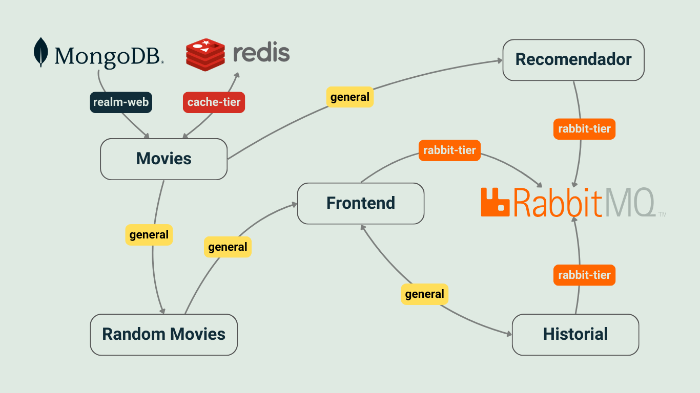

*ENGLISH/INGLES: Welcome, in the following section you will find the explanation of the project in english. If needed you can find it in spanish further below*

*SPANISH/ESPAÑOL: Bienvenido, en la siguiente sección encontrarás la explicación del proyecto en inglés. De ser necesario, podes encontrarla en español más abajo*

## DESCRIPTION OF PROJECT IN ENGLISH ##

##### Microservices Project 
Final project for the subject Advanced Topics in Web Development 2024, Universidad Nacional del Sur.

The project involves implementing a simple web page that recommends movies based on the ones the user explores. The page displays a grid of movie posters, for example, in a 5x4 layout. When a user clicks on a poster, they can view the movie's plot.

The system records the history of movies the user has been viewing and recommends a movie based on the last N movies examined. The recommendation can appear as a poster in a separate panel, similar to YouTube's interface, or it can replace a movie in the grid. The recommendation criteria are flexible, although a modern approach to recommendation systems will be discussed in class.

The general microservices architecture to be implemented is as follows:

The History microservice stores information in RabbitMQ, and the Recommender uses this information to suggest a movie. This movie is integrated into the frontend. Recommendations can be made automatically (with each click), after a specific number of clicks, or manually via a "Recommend" button, although the latter option is less common.

#### Table of Contents
- [Microsevices](#microservices)
- [Installation](#installation)
- [Usage](#usage)

# Microservices
This project consists of six microservices working together to create a cohesive system. The frontend itself is a microservice, offering users an intuitive interface for interacting with movie data. Below is a detailed breakdown of each microservice and its role:

*First*, we have movies. 
The Movies microservice is responsible for communicating directly with the MongoDB movie database. As the sole service with database access, it isolates the database from other services, ensuring secure and efficient operations. By using Redis as a caching layer, the service minimizes overhead and provides fast access to frequently requested data, effectively simulating the database's behavior for the other services.

*Second*, we have random movies. 
The Random Movies microservice interacts with the Movies service to fetch a specified number of movies. These movies are then sent to the frontend for display. 

*Third*, we have the frontend. 
The Frontend microservice provides the user interface, displaying a grid of movie posters. Users can click on a movie to view its name, plot, and rating. Initially, the frontend uses the Random Movies service to populate the mosaic. As users interact, the system dynamically updates the movie selection based on recommendations from the Recommender and click data processed by the History service. New movie recommendations are delivered through a RabbitMQ queue named recommendation.

*Fourth*, we have the history (historial). 
The History microservice tracks user interactions with the frontend. Each time a user clicks on a movie, the service records this event. After accumulating five clicks, it packages the data and sends it to the Recommender service via a RabbitMQ queue named movies. This package includes all necessary information for generating recommendations.

*Fifth*, we have the recommender (recomendador). 
The Recommender microservice receives click data from the History service through the movies queue. It analyzes the received data and generates new movie recommendations. These recommendations are then sent back to the frontend via the recommendation queue.

## Installation
To run this project, simply build and run the Docker Compose file. Before doing so, ensure that you meet all the requirements specified in the README files located in each microservice's folder.

### Usage
After completing the installation and ensuring all services are running, visit the following link to access the final result of the project: "http://localhost:80/".

## DESCRIPCIÓN DEL PROYECTO EN ESPAÑOL ##

##### Proyecto Microservicios
Proyecto final para la materia Tópicos Avanzados de Desarrollo Web 2024, Universidad Nacional del Sur.

El proyecto consiste en la implementación de una página simple que recomienda películas en función de las peliculas que el usuario examina. La página simplemente muestra un mosaico de posters de peliculas en una grilla, por ejemplo, de 5x4. Cuando el usuario clickea un poster puede ver el plot de la película. 
El sistema registra el historial de películas que el usuario viene examinando y recomienda una pelicula en función de las últimas N examinadas. La recomendación puede ubicarse como poster en un panel aparte, al estilo Youtube, o puede reemplazar alguna pelicula de la grilla. El criterio de recomendación es libre, aunque mostraremos en clase una aproximación moderna a los sistemas de recomendación. 

La arquitectura general de microservicios a implementar es la siguiente:

El microservicio de historial guarda información en RabbitMQ, y el recomendador toma esta información para sugerir alguna película. Esta pelicula se integra en el frontend. La recomendación se puede hacer de manera automática, en cada click, o cada tantos clicks o de manera manual por medio de un botón para recomendar, aunque esta última opción es tal vez la menos habitual. 

#### Tabla de Contenidos
- [Microsevicios](#microservicios)
- [Instalación](#instalacion)
- [Uso](#uso)

# Microservicios
Este proyecto consta de seis microservicios que trabajan juntos para formar un sistema cohesivo. El frontend en sí es un microservicio que ofrece a los usuarios una interfaz intuitiva para interactuar con los datos de las películas. A continuación, se presenta un desglose detallado de cada microservicio y su función:

*Primero*, tenemos Movies.
El microservicio Movies es responsable de comunicarse directamente con la base de datos de películas MongoDB. Al ser el único servicio con acceso a la base de datos, aísla la base de datos de los demás servicios, garantizando operaciones seguras y eficientes. Utilizando Redis como una capa de caché, este servicio minimiza la sobrecarga y proporciona un acceso rápido a los datos solicitados con frecuencia, simulando eficazmente el comportamiento de la base de datos para los otros servicios.

*Segundo*, tenemos Random Movies.
El microservicio Random Movies interactúa con el servicio Movies para obtener una cantidad específica de películas. Estas películas luego se envían al frontend para su visualización.

*Tercero*, tenemos el Frontend.
El microservicio Frontend proporciona la interfaz de usuario, mostrando una cuadrícula de carteles de películas. Los usuarios pueden hacer clic en una película para ver su nombre, trama y calificación. Inicialmente, el frontend utiliza el servicio Random Movies para rellenar el mosaico. A medida que los usuarios interactúan, el sistema actualiza dinámicamente la selección de películas basándose en recomendaciones del Recommender y los datos de clic procesados por el servicio History. Las nuevas recomendaciones de películas se entregan a través de una cola de RabbitMQ llamada recommendation.

*Cuarto*, tenemos el History (Historial).
El microservicio History rastrea las interacciones de los usuarios con el frontend. Cada vez que un usuario hace clic en una película, el servicio registra este evento. Después de acumular cinco clics, empaqueta los datos y los envía al servicio Recommender a través de una cola de RabbitMQ llamada movies. Este paquete incluye toda la información necesaria para generar recomendaciones.

*Quinto*, tenemos el Recommender (Recomendador).
El microservicio Recommender recibe los datos de clics del servicio History a través de la cola movies. Analiza los datos recibidos y genera nuevas recomendaciones de películas. Estas recomendaciones se envían de vuelta al frontend a través de la cola recommendation.

# Instalación
Para ejecutar este proyecto, simplemente construye y ejecuta el archivo de Docker Compose. Antes de hacerlo, asegúrate de cumplir con todos los requisitos especificados en los archivos README ubicados en la carpeta de cada microservicio.

# Uso
Después de completar la instalación y asegurarte de que todos los servicios estén en funcionamiento, visita el siguiente enlace para acceder al resultado final del proyecto: "http://localhost:80/".