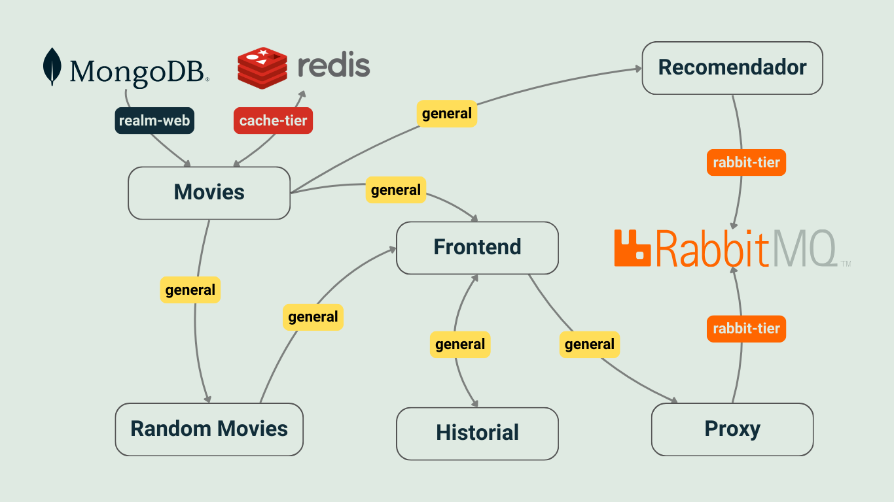

# Proyecto Microservicios
Proyecto final para la materia Tópicos Avanzados de Desarrollo Web 2024, Universidad Nacional del Sur.

El proyecto consiste en la implementación de una página simple que recomienda películas en función de las peliculas que el usuario examina. La página simplemente muestra un mosaico de posters de peliculas en una grilla, por ejemplo, de 5x4. Cuando el usuario clickea un poster puede ver el plot de la película. 
El sistema registra el historial de películas que el usuario viene examinando y recomienda una pelicula en función de las últimas N examinadas. La recomendación puede ubicarse como poster en un panel aparte, al estilo Youtube, o puede reemplazar alguna pelicula de la grilla. El criterio de recomendación es libre, aunque mostraremos en clase una aproximación moderna a los sistemas de recomendación. 

La arquitectura general de microservicios a implementar es la siguiente:

El microservicio de historial guarda información en RabbitMQ, y el recomendador toma esta información para sugerir alguna película. Esta pelicula se integra en el frontend. La recomendación se puede hacer de manera automática, en cada click, o cada tantos clicks o de manera manual por medio de un botón para recomendar, aunque esta última opción es tal vez la menos habitual. 